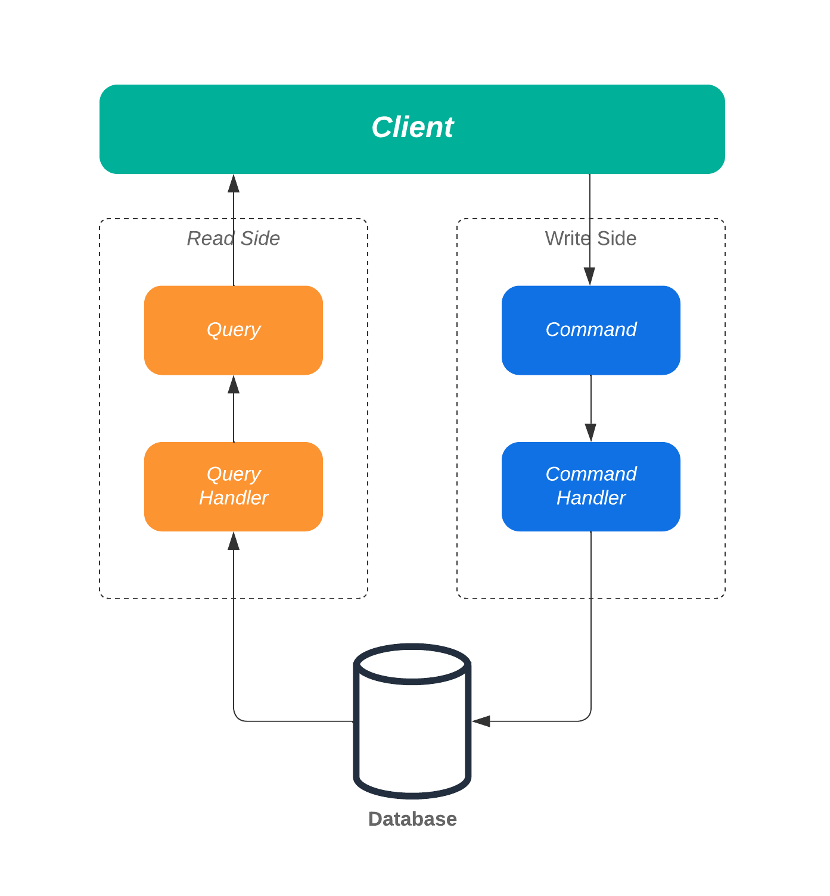

# Homework 2 - Prova in itinere DSBD 2024/25

**Autore:** Matteo Santanocito - 1000069999  
**Data:** *(inserire data corrente)*

---

## Table of Contents

1. [Abstract](#abstract)
2. [Diagramma del sistema](#diagramma-del-sistema)
3. [Dettagli delle novità introdotte](#dettagli-delle-novità-introdotte)
   - [CQRS](#cqrs)
   - [Implementazione Apache Kafka](#implementazione-apache-kafka)
4. [Componenti principali](#componenti-principali)
   - [Data Collector](#data-collector)
   - [Alert System](#alert-system)
   - [Alert Notifier](#alert-notifier)

---

## Abstract

L'obiettivo di questo secondo Homework è introdurre una nuova modalità di interazione con il database, adottando il **pattern CQRS** e ampliando l’architettura esistente. Inoltre, il progetto include una funzione di **notifica asincrona** che avvisa l’utente via email quando il valore di un determinato ticker supera o scende sotto una soglia definita (high-value/low-value).

Gli utenti possono impostare una o entrambe le soglie e aggiornarle tramite specifiche chiamate RPC. Le notifiche sono gestite tramite **Apache Kafka**, con un cluster di tre broker e un meccanismo per evitare spam tramite una cache che riduce l’invio di email non necessarie. Questo approccio migliora l'efficienza e riduce il carico sul server SMTP esterno.

---

## Diagramma del sistema

Rispetto all'HW1, sono stati introdotti **7 nuovi container**:  
- **Kafka-admin**, **AlertSystem**, **AlertNotifier**, **ZooKeeper**, e tre broker Kafka.  
Questi componenti aggiungono nuove funzionalità descritte nell’abstract.

### **Motivazioni dietro Kafka-admin**

La gestione del cluster Kafka è stata isolata in un container dedicato, seguendo il principio di separazione delle responsabilità. Questo rende più semplice la gestione centralizzata di attività come la creazione dei topic e il recupero dei metadati.

---

## Dettagli delle novità introdotte

### **CQRS**

Il **pattern CQRS** separa le operazioni di scrittura (comandi) da quelle di lettura (query), migliorando la scalabilità e la manutenibilità del sistema.

#### **Struttura**

1. **UserCommandService**:
   - Gestisce le operazioni di scrittura e i controlli di validazione, come il controllo sulla sintassi delle email durante la registrazione.
   - Esempi di comandi: aggiornamento di profili utente, eliminazione di record.

2. **UserQueryService**:
   - Gestisce le operazioni di lettura senza modificare lo stato.
   - Esempio di query: recupero dei valori finanziari più recenti.

---

### **Implementazione Apache Kafka**

L’integrazione con Kafka è gestita tramite il modulo **Kafka Admin**, che si occupa di:
1. **Creazione dei topic**: Controlla l’esistenza dei topic e li crea se necessario.
2. **Recupero dei metadati**: Monitora lo stato del cluster e registra informazioni sui broker, topic e partizioni.
3. **Monitoraggio continuo**: Ogni 120 secondi, verifica lo stato del cluster.

---

## Componenti principali

### **Data Collector**

Il **Data Collector** raccoglie i dati finanziari più recenti e invia un messaggio al topic `to-alert-system`. Questo segnale avvia l’elaborazione successiva da parte dell’**Alert System**.

- **Funzioni principali**:
  - Recupero dei ticker degli utenti dal database.
  - Raccolta dei dati di mercato tramite `yfinance`.
  - Invio di un messaggio di notifica per completare il ciclo di raccolta.

- **Kafka Producer Configurato**:
  - `linger.ms = 0`: Invio immediato dei messaggi.
  - `acks = all`: Conferma da tutte le repliche sincronizzate.

---

### **Alert System**

L'**Alert System** monitora i dati finanziari e invia notifiche agli utenti quando vengono superate le soglie definite.  
Si connette al topic `to-alert-system` come consumer e utilizza il topic `to-notifier` per produrre notifiche.

- **Funzioni principali**:
  1. **Consumo dei messaggi Kafka**:
     - Consuma messaggi da `to-alert-system` per avviare l’elaborazione.
  2. **Verifica delle soglie**:
     - Confronta i valori finanziari con le soglie definite dall’utente.
     - Genera notifiche solo se i valori superano i limiti.
  3. **Produzione delle notifiche Kafka**:
     - Invia notifiche dettagliate al topic `to-notifier`.

- **Kafka Producer Configurato**:
  - `linger.ms = 500`: Accumula messaggi in batch per ottimizzare la rete.
  - `compression.type = gzip`: Riduce la dimensione dei messaggi.

---

### **Alert Notifier**

Il **Alert Notifier** riceve i messaggi dal topic `to-notifier` e invia notifiche via email. Utilizza una **cache** per prevenire l’invio di email ridondanti.

- **Funzioni principali**:
  1. **Consumo dei messaggi Kafka**:
     - Elabora i messaggi ricevuti da `to-notifier`.
  2. **Controllo della cache**:
     - Verifica se i dati correnti differiscono da quelli precedenti.
     - Invio email solo per variazioni significative.
  3. **Invio della notifica**:
     - Utilizza il modulo `send_email_template` per formattare e inviare l'email.

- **Kafka Consumer Configurato**:
  - `group.id = alert_notifier_group`: Gruppo dedicato per gestire i messaggi.
  - `auto.offset.reset = earliest`: Elabora i messaggi dall’inizio del topic.
  - `enable.auto.commit = False`: Commit manuale degli offset per garantire un’elaborazione affidabile.

---

### **Parametri di configurazione di Kafka**

| Parametro                           | Valore                           | Descrizione                                                                 |
|-------------------------------------|-----------------------------------|-----------------------------------------------------------------------------|
| `bootstrap.servers`                 | kafka-broker-1:9092,...          | Specifica gli indirizzi dei broker Kafka.                                   |
| `acks`                              | all                              | Conferma da tutte le repliche sincronizzate.                                |
| `linger.ms`                         | 0 (Data Collector), 500 (Alert System) | Tempo di attesa prima di inviare i messaggi.                                |
| `compression.type`                  | gzip                             | Compressione dei messaggi per ottimizzare la larghezza di banda.            |
| `max.in.flight.requests.per.connection` | 1                               | Garantisce l’ordine dei messaggi.                                           |
| `retries`                           | 3                                | Tentativi di reinvio in caso di errore.                                     |
